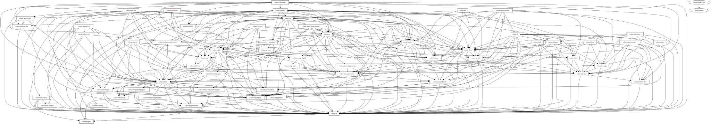

# Dependency graph

This project contains scripts to create a visual dependency graph of Solana modules.

# Prerequisites

The following tools need to be installed:
- Solana project, with a working `cargo depgraph` command
- [Optional] `GraphViz`, to convert from `.gvz` format to image.
- [Optional] `xdot`, a `.gvz` viewer.

# Syntax

A typical invocation would be

```shell
./soldeps.py --solana-root ../solana --output soldeps.gvz --include includes.txt --exclude excludes.txt
```

The generated `.gvz` can be converted to `.svg` image format by running

```shell
dot -Tsvg soldeps.gvz -o soldeps.svg
```

The generated `.gvz` can also be viewed with the `xdot` tool
```shell
xdot soldeps.gvz
```

# Example

The following is an example, filtered graph for solana, which:
- Includes only the `solana-*` modules, as defined in [includes.txt](includes.txt)  
  So, this graph does not show rust dependencies, as well as potential solana dendencies that do not follow the `solana-*` pattern.
- Excludes some `solana-*` modules, as defined by the rules in [excludes.txt](excludes.txt)  
  This is to remove from the graph various utility modules (benchmarks, tests, api, profiling...)

